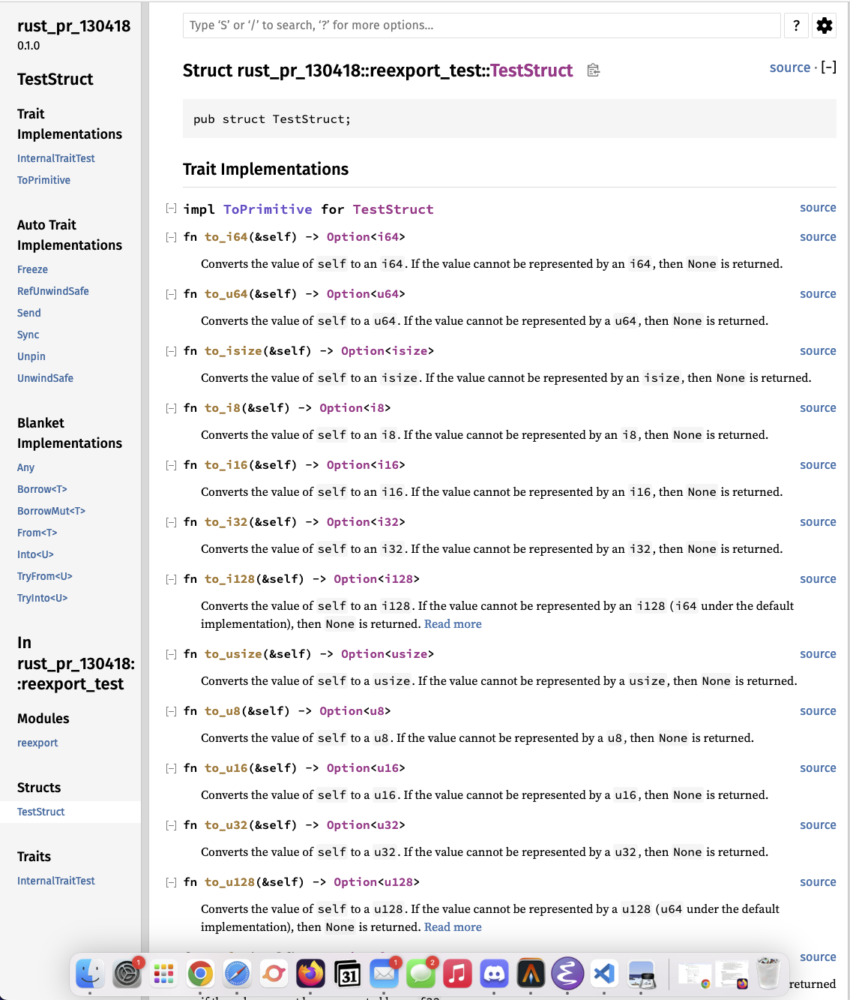

# Rust PR#130418

This is a repository for Rust's [PR#130418](https://github.com/rust-lang/rust/pull/130418).

## Current Nightly RustDoc

This is what current nightly rustdoc produces for `src/main_test.rs`.

This is what the current nightly rustdoc produces for `src/reexport_test.rs`.

## Proposed Changes

This is what the proposed changes produce for `src/main_test.rs`.

This is what the proposed changes produce for `src/reexport_test.rs`. Note that in the case of reexports, they are still being recognized as a foreign trait.

